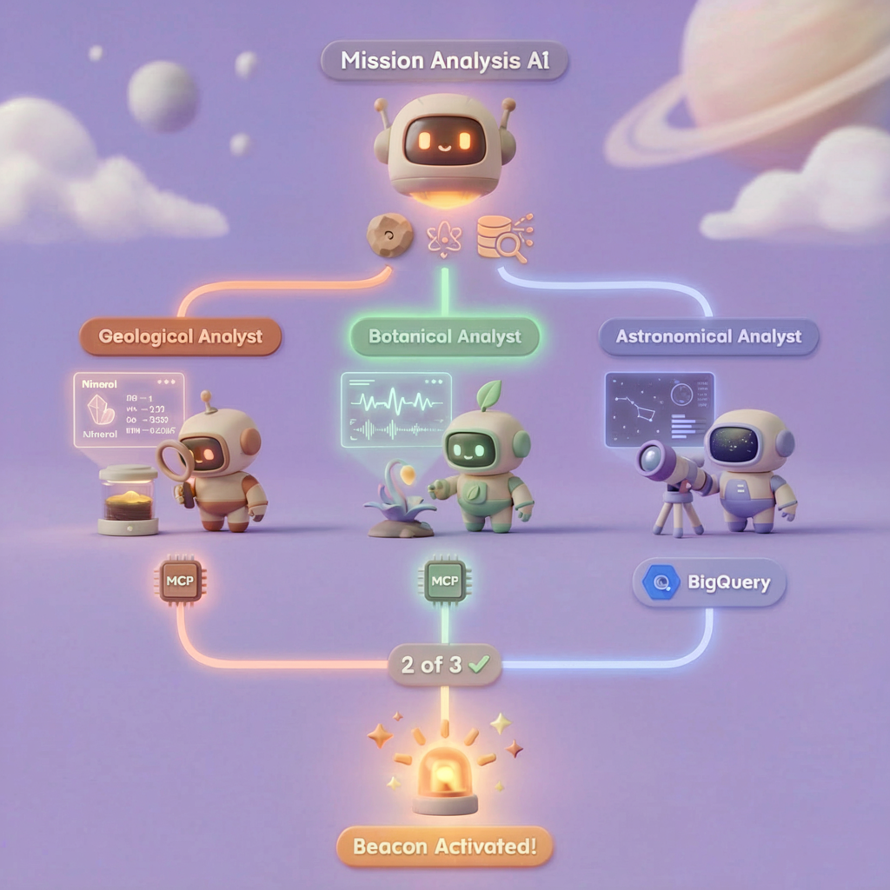
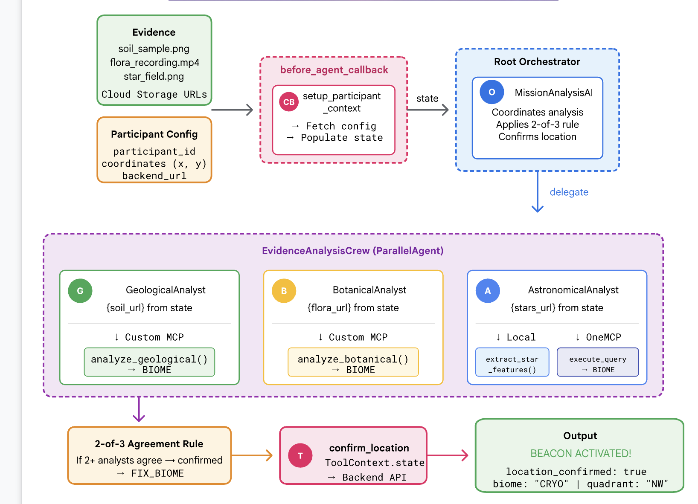
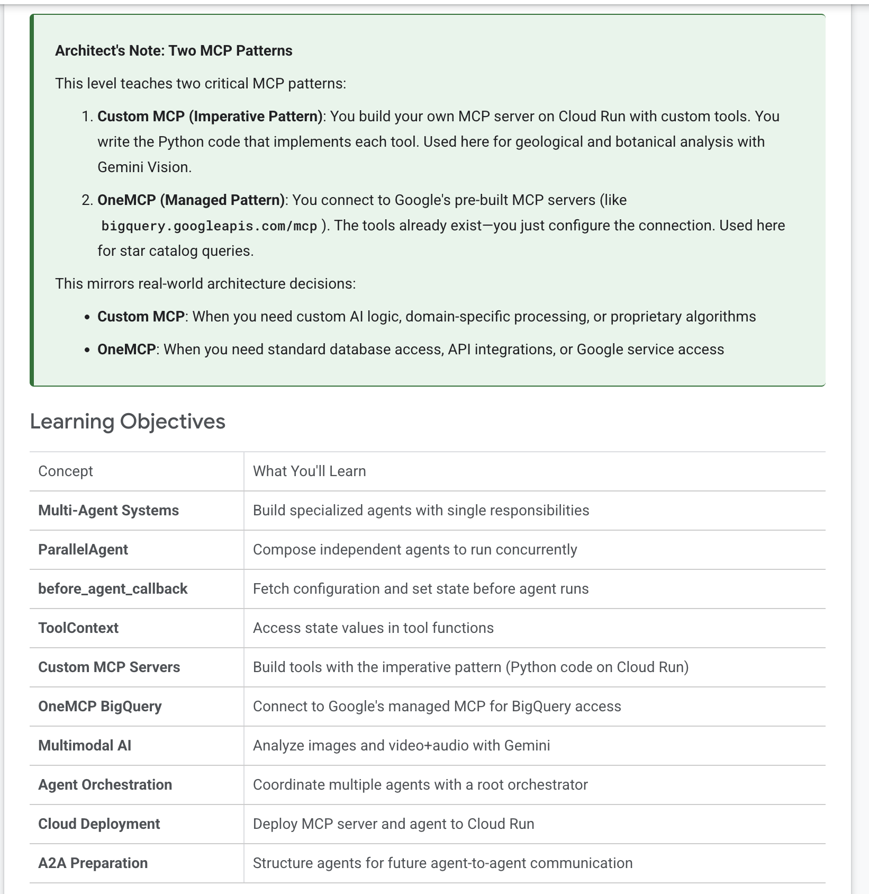
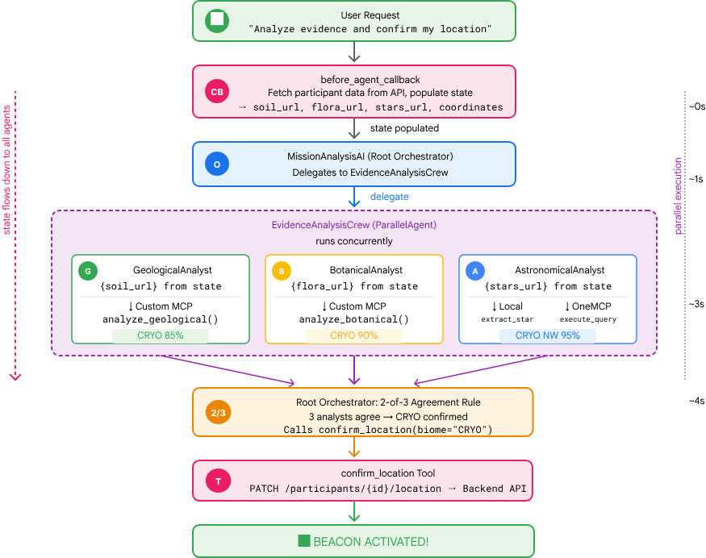
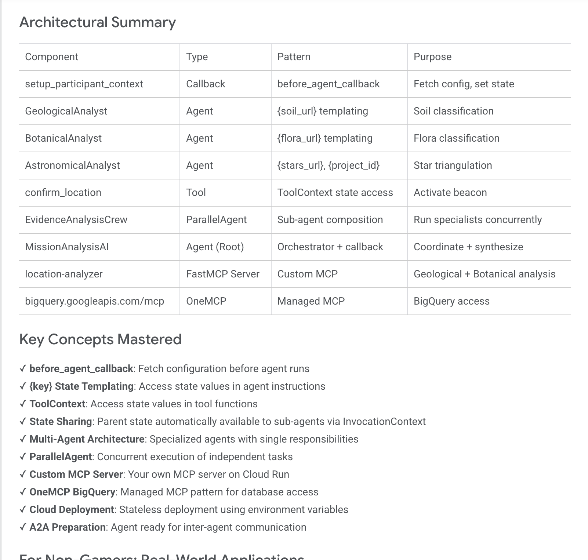
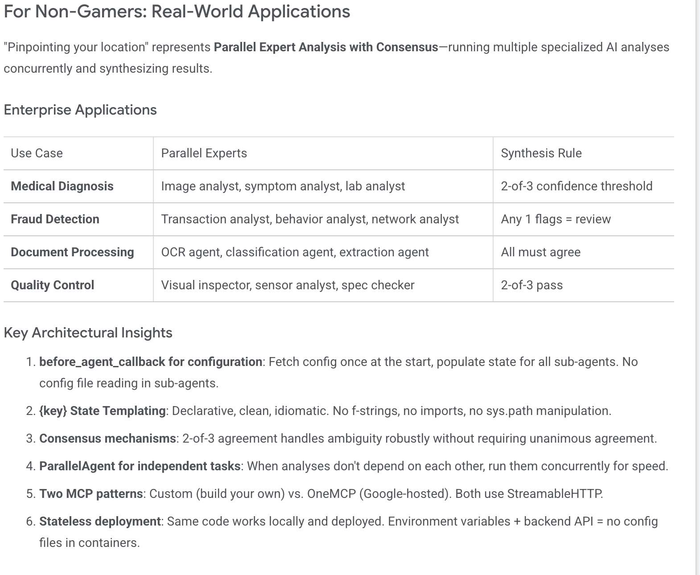
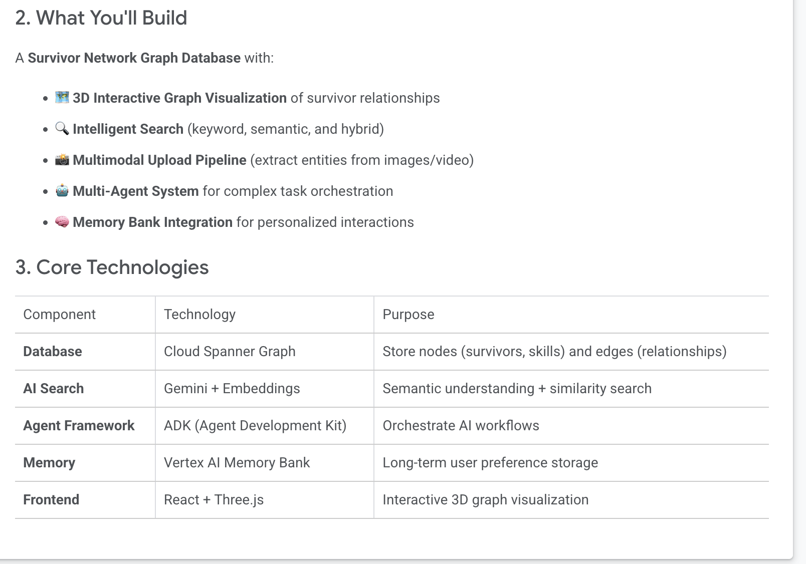
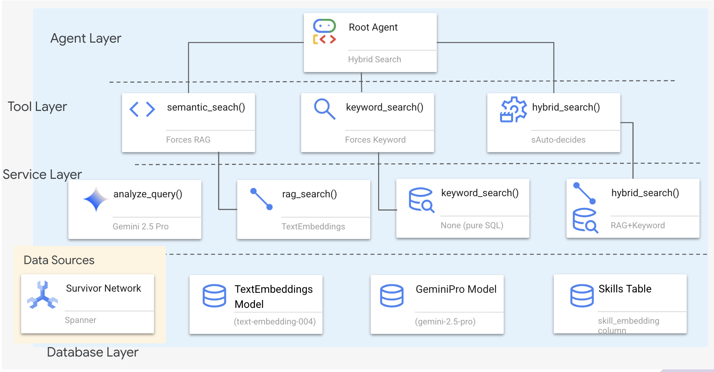
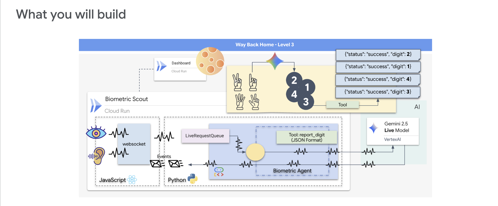
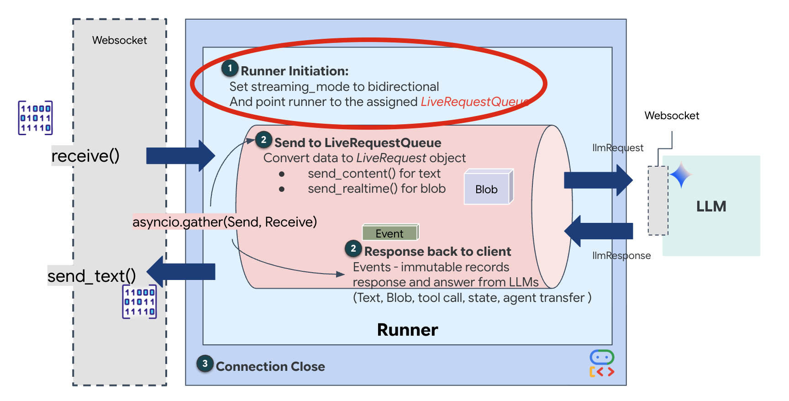

# Labs Info 
1. Day1 Lab ID: production-ready-ai-nk8aokvpxh ($5)
2. Day2 Lab ID: waybackhome-v7j3phccypg8u76md9 ($20)

# multimodel_google_meetup_dc
Google AI 


# Credis Emails
1. anjaiahspr@gmail.com
2. anjaiahsprcloud@gmail.com

# Google ADK & References
1. https://github.com/arjunprabhulal/google-adk-masterclass/tree/main/15-mcp-deep-dive
2. https://arjunprabhulal.com/
3. https://codelabs.developers.google.com/onramp/instructions#8
4. https://colab.research.google.com/drive/10aC9vrBD8y_UlR9CcmuXuvBBPnkZ8i7M#scrollTo=jLycvdEmmU5R
5. https://codelabs.developers.google.com/way-back-home-level-0/instructions#4
6. https://codelabs.developers.google.com/way-back-home-level-1/instructions#0
7. https://github.com/google-americas/way-back-home/tree/main
8. https://codelabs.developers.google.com/onramp/instructions#8

# AWS Stuff
1. https://github.com/aws-samples/sample-multimodal-agent-tutorial/tree/main


# MeetupLocation
1. https://goo.gle/mcpserver
2. https://goo.gle/buildwithai-dc


# Day 1 Labs

https://waybackhome-dc-789872749985.us-central1.run.app/day1.html


## LAB-1
1. https://codelabs.developers.google.com/codelabs/production-ready-ai-roadshow/1-building-a-multi-agent-system/building-a-multi-agent-system#12

2. git clone https://github.com/amitkmaraj/prai-roadshow-lab-1-starter.git


## LAB-2
2. https://codelabs.developers.google.com/codelabs/production-ready-ai-roadshow/2-evaluating-multi-agent-systems/evaluating-multi-agent-systems#0

2. git clone https://github.com/vladkol/agent-evaluation-lab -b starter


## LAB-3

3. https://codelabs.developers.google.com/codelabs/production-ready-ai-roadshow/3-securing-a-multi-agent-system/securing-a-multi-agent-system#0

3. git clone https://github.com/h3xar0n/prai-roadshow-lab-3-starter


 
 export PATH=/opt/homebrew/share/google-cloud-sdk/bin:"$PATH"


welcome@jaisairams-Laptop level_0 % export GOOGLE_CLOUD_PROJECT=$(gcloud config get-value project)

welcome@jaisairams-Laptop level_0 % echo $GOOGLE_CLOUD_PROJECT


# Day -02

https://waybackhome-dc-789872749985.us-central1.run.app/day2.html

# Lab-1
1. https://codelabs.developers.google.com/way-back-home-level-0/instructions#0

# Lab-2
1. https://codelabs.developers.google.com/way-back-home-level-1/instructions#0









## Lab-2 Flow :



```

Service URL: https://mission-analysis-ai-725152276507.us-central1.run.app


Service URL: https://mission-analysis-ai-725152276507.us-central1.run.app


--> Agents & Apps


---> AI Platform


cd $HOME/way-back-home/level_1

source $HOME/way-back-home/set_env.sh

uv run adk deploy cloud_run \
  --project=$GOOGLE_CLOUD_PROJECT \
  --region=$REGION \
  --service_name=mission-analysis-ai \
  --with_ui \
  --a2a \
  ./agent


```








# Lab 3 (Lab_ID=2)

1. https://codelabs.developers.google.com/codelabs/survivor-network/instructions#0

```
In disaster response scenarios, coordinating survivors with different skills, resources, and needs across multiple locations requires intelligent data management and search capabilities. This workshop teaches you to build a production AI system that combines:

🗄️ Graph Database (Spanner): Store complex relationships between survivors, skills, and resources
🔍 AI-Powered Search: Semantic + keyword hybrid search using embeddings
📸 Multimodal Processing: Extract structured data from images, text, and video
🤖 Multi-Agent Orchestration: Coordinate specialized agents for complex workflows
🧠 Long-Term Memory: Personalization with Vertex AI Memory Bank

```






```
Capture : Multimodel processing :

Graph RAG:

ADK

Agent Memeory :

```

# LAB 4 (LABID=3)

1. https://codelabs.developers.google.com/way-back-home-level-3/instructions#2




```

Full-Duplex vs. Half-Duplex
To understand why we need this for the Neural Sync, you have to understand the flow of data:

Half-Duplex (Standard HTTP): Like a walkie-talkie. One person speaks, says "Over," and then the other person can speak. You cannot listen and talk at the same time.
Full-Duplex (WebSocket): Like a face-to-face conversation. Data flows in both directions simultaneously. While your browser is pushing video frames and audio samples up to the AI, the AI can push voice responses and tool commands down to you at the exact same time.


```




# LAB 5 (LABID=4)
1. https://codelabs.developers.google.com/way-back-home-level-4/instructions#1


# LAB 6 (LABID=5)
1. https://codelabs.developers.google.com/way-back-home-level-5/instructions#0